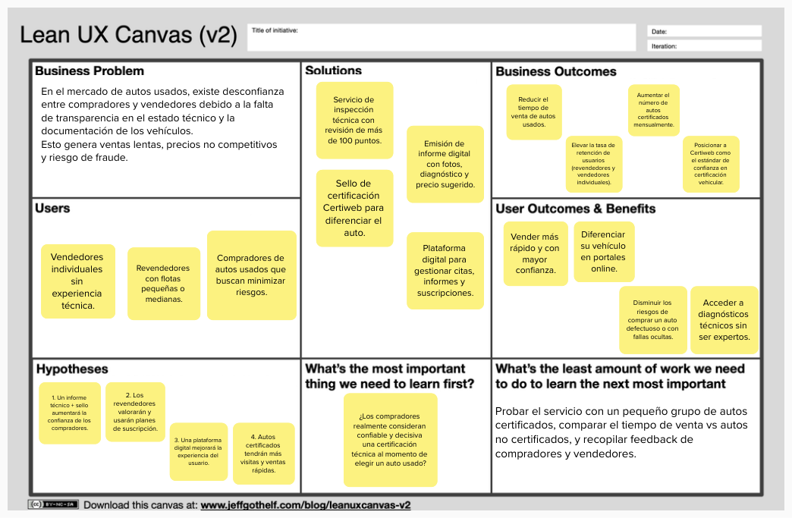

<h1>Informe del Trabajo Final </h1>
<h3 style="text-align: center;"> Universidad Peruana de Ciencias Aplicadas </h3>

<h5 style="text-align: center"> Ingeniería de Software </h5>

<h5 style="text-align: center"> Aplicaciones Web - 4366 </h5>

<h5 style="text-align: center"> Docente: Alex Humberto Sánchez Ponce </h5>

<h5 style="text-align: center"> Startup: Selling Cars Quickly - SCQ </h5>

<h5 style="text-align: center"> Producto: Certiweb </h5>

## Team members:
| Nombre |Código|
|:-------:|:----------:|
|||
|Lopez Roman, Franco Mauricio|U202315890|
|Agama Espinoza, Eric Fabrizio|U202213358|
|Millones Espinoza, Jesus Andres|U20211b598|
|Santos Torres, Juan Manuel|U20221a371|
|Trillo Hernandez, Anghel Melanie|U201912401|

<h5 style="text-align: center"> Ciclo 2025-01 </h5>

### Registro de Versiones del Informe
| Versión | Fecha      | Autor      | Descripción de Modificación                                                                 | 
|---------|------------|------------|---------------------------------------------------------------------------------------------|
|      |   |           |            |

### Project Report Collaboration Insights

| Repositorio Selling Cars Quickly | [https://github.com/Selling-Cars-Quickly-SCQ](https://github.com/Selling-Cars-Quickly-SCQ) |
|--------------------------|-----------------------------------------------|

### Student Outcome
|Criterio Especifico|Acciones Realizadas|Conclusiones|
|------|------------|------------|
|Trabaja en equipo  para  proporcionar liderazgo en   forma conjunta|**Franco Lopez** TB1: [texto]. TP1: [texto]. TB2: [texto]. TF: [texto] **Eric Agama** TB1: [texto]. TP1: [texto]. TB2: [texto]. TF: [texto] **Jesus Millones** TB1: [texto]. TP1: [texto]. TB2: [texto]. TF: [texto]. **Juan Santos** TB1: [texto]. TP1: [texto]. TB2: [texto]. TF: [texto]. **Anghel Trillo** TB1: [texto].  TP1: [texto]. TB2: [texto]. TF: [texto]. |[texto-conclusiones].|
|Crea un entorno colaborativo e  inclusivo, establece  metas, planifica tareas y cumple objetivos|**Franco Lopez** TB1: [texto]. TP1: [texto]. TB2: [texto]. TF: [texto] **Eric Agama** TB1: [texto]. TP1: [texto]. TB2: [texto]. TF: [texto] **Jesus Millones** TB1: [texto]. TP1: [texto]. TB2: [texto]. TF: [texto]. **Juan Santos** TB1: [texto]. TP1: [texto]. TB2: [texto]. TF: [texto]. **Anghel Trillo** TB1: [texto].  TP1: [texto]. TB2: [texto]. TF: [texto]. |[texto-conclusiones].|

# Índice

- [Capítulo I: Introducción](#capítulo-i-introducción)
  - [1.1. Startup Profile](#11-startup-profile)
    - [1.1.1. Descripción de la Startup](#111-descripción-de-la-startup)
    - [1.1.2. Perfiles de integrantes del equipo](#112-perfiles-de-integrantes-del-equipo)
  - [1.2. Solution Profile](#12-solution-profile)
    - [1.2.1. Antecedentes y problemática](#121-antecedentes-y-problemática)
    - [1.2.2. Lean UX Process](#122-lean-ux-process)
      - [1.2.2.1. Lean UX Problem Statements](#1221-lean-ux-problem-statements)
      - [1.2.2.2. Lean UX Assumptions](#1222-lean-ux-assumptions)
      - [1.2.2.3. Lean UX Hypothesis Statements](#1223-lean-ux-hypothesis-statements)
      - [1.2.2.4. Lean UX Canvas](#1224-lean-ux-canvas)
  - [1.3. Segmentos objetivo](#13-segmentos-objetivo)

- [Capítulo II: Requirements Elicitation & Analysis](#capítulo-ii-requirements-elicitation--analysis)
  - [2.1. Competidores](#21-competidores)
    - [2.1.1. Análisis competitivo](#211-análisis-competitivo)
    - [2.1.2. Estrategias y tácticas frente a competidores](#212-estrategias-y-tácticas-frente-a-competidores)
  - [2.2. Entrevistas](#22-entrevistas)
    - [2.2.1. Diseño de entrevistas](#221-diseño-de-entrevistas)
    - [2.2.2. Registro de entrevistas](#222-registro-de-entrevistas)
    - [2.2.3. Análisis de entrevistas](#223-análisis-de-entrevistas)
  - [2.3. Needfinding](#23-needfinding)
    - [2.3.1. User Personas](#231-user-personas)
    - [2.3.2. User Task Matrix](#232-user-task-matrix)
    - [2.3.3. User Journey Mapping](#233-user-journey-mapping)
    - [2.3.4. Empathy Mapping](#234-empathy-mapping)
    - [2.3.5. As-is Scenario Mapping](#235-as-is-scenario-mapping)
  - [2.4. Ubiquitous Language](#24-ubiquitous-language)

- [Capítulo III: Requirements Specification](#capítulo-iii-requirements-specification)
  - [3.1. To-Be Scenario Mapping](#31-to-be-scenario-mapping)
  - [3.2. User Stories](#32-user-stories)
  - [3.3. Impact Mapping](#33-impact-mapping)
  - [3.4. Product Backlog](#34-product-backlog)

- [Capítulo IV: Product Design](#capítulo-iv-product-design)
  - [4.1. Style Guidelines](#41-style-guidelines)
    - [4.1.1. General Style Guidelines](#411-general-style-guidelines)
    - [4.1.2. Web Style Guidelines](#412-web-style-guidelines)
  - [4.2. Information Architecture](#42-information-architecture)
    - [4.2.1. Organization Systems](#421-organization-systems)
    - [4.2.2. Labeling Systems](#422-labeling-systems)
    - [4.2.3. SEO Tags and Meta Tags](#423-seo-tags-and-meta-tags)
    - [4.2.4. Searching Systems](#424-searching-systems)
    - [4.2.5. Navigation Systems](#425-navigation-systems)
  - [4.3. Landing Page UI Design](#43-landing-page-ui-design)
    - [4.3.1. Landing Page Wireframe](#431-landing-page-wireframe)
    - [4.3.2. Landing Page Mock-up](#432-landing-page-mock-up)
  - [4.4. Web Applications UX/UI Design](#44-web-applications-uxui-design)
    - [4.4.1. Web Applications Wireframes](#441-web-applications-wireframes)
    - [4.4.2. Web Applications Wireflow Diagrams](#442-web-applications-wireflow-diagrams)
    - [4.4.3. Web Applications Mock-ups](#443-web-applications-mock-ups)
    - [4.4.4. Web Applications User Flow Diagrams](#444-web-applications-user-flow-diagrams)
  - [4.5. Web Applications Prototyping](#45-web-applications-prototyping)
  - [4.6. Domain-Driven Software Architecture](#46-domain-driven-software-architecture)
    - [4.6.1. Software Architecture Context Diagram](#461-software-architecture-context-diagram)
    - [4.6.2. Software Architecture Container Diagrams](#462-software-architecture-container-diagrams)
    - [4.6.3. Software Architecture Components Diagrams](#463-software-architecture-components-diagrams)
  - [4.7. Software Object-Oriented Design](#47-software-object-oriented-design)
    - [4.7.1. Class Diagrams](#471-class-diagrams)
    - [4.7.2. Class Dictionary](#472-class-dictionary)
  - [4.8. Database Design](#48-database-design)
    - [4.8.1. Database Diagram](#481-database-diagram)

- [Capítulo V: Product Implementation, Validation & Deployment](#capítulo-v-product-implementation-validation--deployment)
  - [5.1. Software Configuration Management](#51-software-configuration-management)
    - [5.1.1. Software Development Environment Configuration](#511-software-development-environment-configuration)
    - [5.1.2. Source Code Management](#512-source-code-management)
    - [5.1.3. Source Code Style Guide & Conventions](#513-source-code-style-guide--conventions)
    - [5.1.4. Software Deployment Configuration](#514-software-deployment-configuration)
  - [5.2. Landing Page, Services & Applications Implementation](#52-landing-page-services--applications-implementation)
    - [5.2.1. Sprint 1](#521-sprint-1)
      - [5.2.1.1. Sprint Planning 1](#5211-sprint-planning-1)
      - [5.2.1.2. Aspect Leaders and Collaborators](#5212-aspect-leaders-and-collaborators)
      - [5.2.1.3. Sprint Backlog 1](#5213-sprint-backlog-1)
      - [5.2.1.4. Development Evidence for Sprint Review](#5214-development-evidence-for-sprint-review)
      - [5.2.1.5. Execution Evidence for Sprint Review](#5215-execution-evidence-for-sprint-review)
      - [5.2.1.6. Services Documentation Evidence for Sprint Review](#5216-services-documentation-evidence-for-sprint-review)
      - [5.2.1.7. Software Deployment Evidence for Sprint Review](#5217-software-deployment-evidence-for-sprint-review)
      - [5.2.1.8. Team Collaboration Insights during Sprint](#5218-team-collaboration-insights-during-sprint)

- [Conclusiones](#conclusiones)

- [Bibliografía](#bibliografía)

- [Anexos](#anexos)

# Capítulo I: Introducción
### 1.1. Startup Profile
#### 1.1.1. Descripción de la Startup

Certiweb es un servicio especializado en la inspección y certificación de vehículos usados. Su objetivo es evaluar técnicamente el estado de los autos antes de ser puestos a la venta, mediante una revisión profesional de más de 100 puntos clave. A través de un informe detallado y un sello de certificación, Certiweb ayuda a generar confianza en los compradores, permitiendo que los vendedores individuales o revendedores puedan vender sus autos más rápido y a un mejor precio.

#### 1.1.2. Perfiles de integrantes del equipo

| Nombre                           | Descripción                                                                                                                                   |
|----------------------------------|-----------------------------------------------------------------------------------------------------------------------------------------------|
| Lopez Roman, Franco Mauricio   |[texto]. |
| Agama Espinoza, Eric Fabrizio    | Soy Eric Agama, estudiante de Ingeniería de Software. Me caracterizo por ser responsable y comprometido en mis trabajos, y siempre busco optimizar la organización dentro del equipo. Tengo experiencia con el lenguaje Luau en Roblox Studio.              |             |
| Millones Espinoza, Jesus Andres         | [texto]. |
| Santos Torres, Juan Manuel         | [texto]. |
| Trillo Hernandez, Anghel Melanie        | [texto]. |

### 1.2. Solution Profile
#### 1.2.1. Antecedentes y problemática

En el mercado de autos usados, la desconfianza es uno de los principales obstáculos para concretar una venta. Muchos compradores temen adquirir vehículos con fallas mecánicas ocultas, documentación incompleta o precios inflados. Por otro lado, los vendedores —especialmente los individuales y pequeños revendedores— encuentran difícil demostrar la calidad de sus autos y destacar en un mercado cada vez más competitivo.
Certiweb, el startup impulsado por la empresa Selling Cars Quickly (SCQ), nace como respuesta a esta problemática. Su propósito es brindar un servicio imparcial de inspección técnica y certificación vehicular que incremente la confianza entre ambas partes del proceso de compra-venta.

Aplicación de las 5 W’s y 2 H’s  
Who (¿Quiénes?):  
Clientes: Vendedores individuales, revendedores y compradores de autos usados.  
Empresa: Selling Cars Quickly (SCQ), a través de su solución Certiweb.

What (¿Qué?):  
Un taller de inspección y certificación vehicular que revisa más de 100 puntos técnicos y documentales de autos usados, generando un informe profesional con sello de calidad.

Where (¿Dónde?):  
En los talleres Certiweb, ubicados estratégicamente para facilitar el acceso de los clientes (con posibilidad futura de expansión).

When (¿Cuándo?):  
Antes de poner en venta un auto usado, como parte del proceso de preparación y publicación en plataformas.

Why (¿Por qué?):  
Para generar transparencia, reducir el riesgo de fraude y acelerar el proceso de venta mediante la confianza que otorga una certificación técnica imparcial.

How (¿Cómo?):  
Mediante una inspección profesional, la emisión de un informe detallado (con fotos, diagnóstico y precio sugerido) y la entrega de un sello que certifica el estado del vehículo.

How Much (¿Cuánto?):  
El servicio está disponible mediante suscripciones mensuales (para revendedores) y anuales (para vendedores ocasionales), con beneficios adicionales como prioridad y descuentos.

### 1.2.2. Lean UX Process
#### 1.2.2.1. Lean UX Problem Statements

<ul style="list-style-type: none; padding-left: 0; font-family: Arial, sans-serif; line-height: 1.6;">
  <li style="margin-bottom: 1.5rem;">
    <h3 style="color: #2c3e50; border-bottom: 2px solid #e74c3c; display: inline-block;">Domain</h3>
    <ul style="padding-left: 20px;">
      <li>Mercado de compra-venta de vehículos usados en Perú</li>
      <li><strong>Problema central:</strong> Confianza baja en el estado de los autos + alto riesgo de fraude</li>
    </ul>
  </li>

  <li style="margin-bottom: 1.5rem;">
    <h3 style="color: #2c3e50; border-bottom: 2px solid #3498db; display: inline-block;">Customer Segments</h3>
    <ul style="padding-left: 20px; list-style-type: square;">
      <li>Vendedores individuales: Buscan vender rápido y seguro</li>
      <li>Revendedores: Necesitan certificaciones constantes para múltiples unidades</li>
      <li>Compradores: Demandan autos con respaldo técnico confiable</li>
    </ul>
  </li>

  <li style="margin-bottom: 1.5rem;">
    <h3 style="color: #2c3e50; border-bottom: 2px solid #9b59b6; display: inline-block;">Pain Points</h3>
    <ul style="padding-left: 20px; list-style-type: circle;">
      <li> Desconfianza en el estado real del vehículo</li>
      <li> Dificultad para diferenciarse en el mercado</li>
      <li> Procesos de venta lentos por falta de transparencia</li>
      <li> Ausencia de certificadores imparciales</li>
    </ul>
  </li>

  <li style="margin-bottom: 1.5rem; background: #f8f9fa; padding: 10px; border-radius: 5px;">
    <h3 style="color: #d35400;">Gap (Vacío en el mercado)</h3>
    <blockquote style="margin-left: 20px; color: #7f8c8d; border-left: 3px solid #34495e; padding-left: 10px;">
      "No existe un servicio accesible, imparcial y profesional que certifique el estado técnico de vehículos usados <strong>sin estar vinculado a su venta o intermediación</strong>"
    </blockquote>
  </li>

  <li style="margin-bottom: 1.5rem;">
    <h3 style="color: #2c3e50; border-bottom: 2px solid #27ae60; display: inline-block;">Vision / Strategy</h3>
    <ul style="padding-left: 20px;">
      <li> Crear un <strong>software de gestión</strong> para inspección/certificación vehicular</li>
      <li> Aumentar transparencia + acelerar ventas + reducir riesgos</li>
    </ul>
  </li>

  <li>
    <h3 style="color: #2c3e50; border-bottom: 2px solid #f39c12; display: inline-block;">Initial Segment</h3>
    <ul style="padding-left: 20px;">
      <li> Vendedores individuales con poca experiencia</li>
      <li> Pequeños revendedores que buscan ventaja competitiva</li>
    </ul>
  </li>
</ul>

#### 1.2.2.2. Lean UX Assumptions

<ul style="font-family: Arial, sans-serif; line-height: 1.8; color: #333; padding-left: 20px;">
  <li style="margin-bottom: 25px;">
    <strong style="color: #e74c3c; font-size: 1.1em;">Business Assumptions</strong>
      <ul style="list-style-type: disc; padding-left: 30px;">
        <li>Existe una oportunidad de negocio en el sector de autos usados ofreciendo un servicio de inspección y certificación imparcial</li>
        <li>Los vendedores están dispuestos a pagar por un servicio que les permita vender sus autos más rápido y a mejor precio</li>
        <li>Revendedores frecuentes buscarán planes de suscripción para optimizar costos y tiempos</li>
        <li>Certiweb puede posicionarse como un referente confiable sin participar en la venta directa</li>
      </ul>
  </li>

  <li style="margin-bottom: 25px;">
    <strong style="color: #3498db; font-size: 1.1em;">Business Outcomes</strong>
      <ul style="list-style-type: square; padding-left: 30px;">
        <li>Incrementar el volumen de certificaciones realizadas por mes</li>
        <li>Reducir el tiempo promedio de venta de autos con certificación Certiweb</li>
        <li>Aumentar la tasa de renovación de suscripciones (mensuales/anuales)</li>
        <li>Lograr una tasa de satisfacción del cliente mayor al 85%</li>
      </ul>
  </li>

  <li style="margin-bottom: 25px;">
    <strong style="color: #2ecc71; font-size: 1.1em;">User Assumptions</strong>
      <ul style="list-style-type: circle; padding-left: 30px;">
        <li>Los vendedores quieren diferenciarse en los portales de venta mediante una certificación técnica</li>
        <li>Los compradores confían más en un vehículo con un informe profesional y sellado</li>
        <li>Los revendedores necesitan un servicio rápido, económico y estandarizado</li>
        <li>Los usuarios valoran la imparcialidad del servicio</li>
      </ul>
  </li>

  <li style="margin-bottom: 25px;">
    <strong style="color: #9b59b6; font-size: 1.1em;">User Outcomes</strong>
      <ul style="list-style-type: '→ '; padding-left: 30px;">
        <li>Vendedores individuales pueden concretar ventas en menos tiempo</li>
        <li>Compradores reducen el riesgo de adquirir un vehículo defectuoso</li>
        <li>Revendedores pueden certificar múltiples autos y aumentar el volumen de ventas</li>
        <li>Los usuarios recomiendan el servicio y repiten su uso</li>
      </ul>
  </li>

  <li style="margin-bottom: 25px; background: #f8f9fa; padding: 15px; border-radius: 8px;">
    <strong style="color: #e67e22; font-size: 1.1em;">Feature Assumptions</strong>
      <ul style="list-style-type: '✓ '; padding-left: 30px;">
        <li>Informe con diagnóstico técnico, imágenes y precio sugerido aumentará la confianza</li>
        <li>El sello Certiweb será un elemento diferenciador visible</li>
        <li>La plataforma permitirá agendar inspecciones y gestionar suscripciones</li>
        <li>La automatización reducirá errores y mejorará la experiencia</li>
      </ul>
  </li>

  <li style="margin-bottom: 15px;">
    <strong style="color: #1abc9c; font-size: 1.1em;">Feature Outcomes</strong>
      <ul style="list-style-type: none; padding-left: 30px;">
        <li>80% de los autos certificados se venden en menos de 30 días</li>
        <li>90% de los compradores confía más en autos con el sello Certiweb</li>
        <li>Revendedores gestionan 5+ inspecciones/mes</li>
        <li>Minimizan errores humanos en informes gracias a la plataforma digital</li>
      </ul>
  </li>

</ul>

#### 1.2.2.3. Lean UX Hypothesis Statements

<strong><li>Sí ofrecemos un informe técnico detallado con un sello de certificación visual (Certiweb), entonces los compradores confiarán más en el auto, lo que permitirá que los vendedores concreten ventas en menos tiempo.</li>

<li>Si los revendedores cuentan con un plan de suscripción que les permita realizar múltiples inspecciones a bajo costo, entonces usarán nuestro servicio recurrentemente para mantener su stock certificado y competitivo.</li> 

<li>Si desarrollamos una plataforma digital que permita a los usuarios agendar inspecciones, visualizar informes y administrar suscripciones fácilmente, entonces mejoraremos la experiencia de usuario y aumentaremos la retención.</li> 

<li>Si los autos certificados por Certiweb son destacados en plataformas de venta online, entonces recibirán más visitas e interés que autos sin certificación, aumentando la posibilidad de venta.</li></strong>

#### 1.2.2.4. Lean UX Canvas

[Link del Canvas](https://app.mural.co/t/certiwerb1488/m/certiwerb1488/1744410865572/59e706ebe76d0e4606051edfad70dcd865593dee?sender=u14a78cec8f790f32120e9679)

### 1.3. Segmentos objetivo

Certiweb se dirige a segmentos específicos dentro del mercado de compra y venta de vehículos usados, identificando tanto necesidades como patrones de comportamiento. Los principales segmentos objetivo se clasifican en tres grupos:

<ul style="font-family: 'Segoe UI', sans-serif; line-height: 1.7; color: #333; padding-left: 0;">

  <!-- 1. Vendedores Individuales -->
  <li style="margin-bottom: 30px; border-left: 4px solid #e74c3c; padding-left: 15px;">
    <strong style="color: #e74c3c; font-size: 1.2em;">1. Vendedores individuales de autos usados</strong>
    <ul style="list-style-type: none; padding-left: 20px;">
      <!-- Demográficos -->
      <li><strong>📊 Características demográficas:</strong>
        <ul style="list-style-type: circle; color: #7f8c8d;">
          <li>Edad: 25-55 años</li>
          <li>Ubicación: Lima, Arequipa, Trujillo, Piura</li>
          <li>NSE: Medio y medio-alto</li>
          <li>Conocimientos técnicos: Limitados</li>
        </ul>
      </li>
      <!-- Comportamiento -->
      <li><strong>🔄 Comportamiento y necesidades:</strong>
        <ul style="list-style-type: square; color: #34495e;">
          <li>Venden 1 auto cada 2-5 años</li>
          <li>Buscan diferenciar sus publicaciones</li>
          <li>Necesitan cerrar ventas rápidamente</li>
        </ul>
      </li>
      <!-- Sustento Estadístico -->
      <li><strong>📈 Sustento Estadístico:</strong>
        <ul style="list-style-type: none; background: #f8f9fa; padding: 10px; border-radius: 5px;">
          <li>70% transacciones entre particulares (AAP 2023)</li>
          <li>64% compradores usan plataformas online</li>
        </ul>
      </li>
    </ul>
  </li>

  <!-- 2. Revendedores -->
  <li style="margin-bottom: 30px; border-left: 4px solid #3498db; padding-left: 15px;">
    <strong style="color: #3498db; font-size: 1.2em;">2. Revendedores o pequeños comerciantes de autos usados</strong>
    <ul style="list-style-type: none; padding-left: 20px;">
      <!-- Demográficos -->
      <li><strong>📊 Características demográficas:</strong>
        <ul style="list-style-type: circle; color: #7f8c8d;">
          <li>Edad: 30-60 años</li>
          <li>Base operativa: Capitales regionales</li>
          <li>Perfil: Informales o pequeños emprendimientos</li>
        </ul>
      </li>
      <!-- Comportamiento -->
      <li><strong>🔄 Comportamiento y necesidades:</strong>
        <ul style="list-style-type: square; color: #34495e;">
          <li>Manejan 3-15 vehículos/mes</li>
          <li>Requieren inspecciones rápidas</li>
          <li>Prefieren herramientas digitales</li>
        </ul>
      </li>
      <!-- Sustento Estadístico -->
      <li><strong>📈 Sustento Estadístico:</strong>
        <ul style="list-style-type: none; background: #f8f9fa; padding: 10px; border-radius: 5px;">
          <li>20% mercado controlado por revendedores</li>
          <li>Falta de sistemas estandarizados actualmente</li>
        </ul>
      </li>
    </ul>
  </li>

  <!-- 3. Compradores -->
  <li style="border-left: 4px solid #2ecc71; padding-left: 15px;">
    <strong style="color: #2ecc71; font-size: 1.2em;">3. Compradores</strong>
    <ul style="list-style-type: none; padding-left: 20px;">
      <!-- Demográficos -->
      <li><strong>📊 Características demográficas:</strong>
        <ul style="list-style-type: circle; color: #7f8c8d;">
          <li>Edad: 22-50 años</li>
          <li>Zonas: Lima (60%), regiones clave</li>
          <li>Perfil: Jóvenes profesionales/familias</li>
        </ul>
      </li>
      <!-- Comportamiento -->
      <li><strong>🔄 Comportamiento y necesidades:</strong>
        <ul style="list-style-type: square; color: #34495e;">
          <li>Buscan primer/segundo vehículo</li>
          <li>Priorizan seguridad sobre lujo</li>
          <li>Desconfían de publicaciones sin respaldo</li>
        </ul>
      </li>
      <!-- Sustento Estadístico -->
      <li><strong>📈 Sustento Estadístico:</strong>
        <ul style="list-style-type: none; background: #f8f9fa; padding: 10px; border-radius: 5px;">
          <li>86% autos vendidos son usados (2023)</li>
          <li>60% comprados por personas naturales</li>
          <li>Confianza = principal barrera (INEI/AAP)</li>
        </ul>
      </li>
    </ul>
  </li>
</ul>

[↑ Volver al índice](#índice)
# Capítulo II: Requirements Elicitation & Analysis
### 2.1. Competidores
#### 2.1.1. Análisis competitivo
|Aspecto | Certiweb | Kavak | Neoautos (Perú) | Revisado.pe (Perú)|
|----|----|----|----|----|
Tipo de solución | Inspección y certificación técnica independiente | Compra y venta directa con inspección propia | Marketplace de autos usados | Revisión técnica in situ|
Público objetivo | Revendedores, comerciantes y particulares | Compradores y vendedores de autos usados | Vendedores y compradores particulares y concesionarios | Compradores y vendedores particulares|
Principales funciones | Revisión técnica de +100 puntos, informe y sello | Compra, reacondicionamiento, venta de autos | Publicación de vehículos, contacto comprador-vendedor | Inspección técnica visual y funcional|
Fortalezas | Transparencia, confianza, servicio móvil, adaptable | Infraestructura robusta, financiación | Alto tráfico web, presencia consolidada en Perú | Técnicos certificados, informe presencial|
Debilidades | Marca nueva, depende de alianzas para escalar | Alto costo de operación, limitado a ciertas ciudades | No realiza inspección técnica | Limitado a zonas urbanas|
Oportunidades | Alianzas con marketplaces y revendedores, certificación como diferencial | Expansión a nuevos países, fidelización | Integrar servicios como inspección o certificación | Convertirse en estándar previo a la compra|
Amenazas | Bajo conocimiento del servicio, imitaciones | Competencia creciente, modelos independientes | Nuevos marketplaces con servicios integrados | Saturación del servicio en zonas de alta demanda|
Precios y costos | Precio por vehículo (flexible según volumen) | Precio incluido en margen de reventa | Publicación gratuita o con planes premium | Costo moderado por inspección presencial ($30–$50)|
Estrategias de marketing | Alianzas B2B, presencia en plataformas de venta, sello visible en avisos | Publicidad digital masiva, promociones | SEO, anuncios destacados, redes sociales | Redes sociales, convenios con talleres|

#### 2.1.2. Estrategias y tácticas frente a competidores

### 2.2. Entrevistas
#### 2.2.1. Diseño de entrevistas

#### 2.2.2. Registro de entrevistas

#### 2.2.3. Análisis de entrevistas

### 2.3. Needfinding
#### 2.3.1. User Personas

#### 2.3.2. User Task Matrix

| TASK                                                            | Revendedor(a) FREQUENCY | Revendedor(a) IMPORTANCE | Concencionario(a) FREQUENCY | Concencionario(a) IMPORTANCE | Comprador(a) FREQUENCY  | Comprador(a) IMPORTANCE  |
|-----------------------------------------------------------------|-------------------------|--------------------------|-----------------------------|------------------------------|-------------------------|--------------------------|
| Preparar vehículo para venta                                    | Always                  | High                     | Never                       | Low                          | Always                  | High                     |
| Publicar anuncios en plataformas                                | Always                  | High                     | Never                       | Low                          | Always                  | High                     |
| Coordinar visitas para mostrar el auto                          | Sometimes               | Medium                   | Sometimes                   | Medium                       | Always                  | High                     |
| Revisar vehículos en venta (búsqueda y comparación)             | Never                   | Low                      | Always                      | High                         | Sometimes               | Medium                   |
| Coordinar inspecciones o revisiones mecánicas                   Sometimes                 | Medium                   | Sometimes                   | High                         | Always                  | High                     |
| Verificar documentación legal y técnica del auto                | Always                  | High                     | Always                      | High                         | Always                  | High                     |
| Negociar el precio                                              | Always                  | High                     | Sometimes                   | Medium                       | Always                  | High                     |
| Generar confianza frente al otro usuario (vendedor o comprador) | Always                  | High                     | Always                      | High                         | Always                  | High                     |
| Validar estado técnico del auto de forma objetiva               | Sometimes               | High                     | Always                      | High                         | Always                  | High                     |
| Concretar la venta o compra con seguridad                       | Always                  | High                     | Always                      | High                         | Always                  | High                     |

#### 2.3.3. User Journey Mapping

#### 2.3.4. Empathy Mapping

#### 2.3.5. As-is Scenario Mapping

### 2.4. Ubiquitous Language

[↑ Volver al índice](#índice)
# Capítulo III: Requirements Specification
### 3.1. To-Be Scenario Mapping

### 3.2. User Stories

### 3.3. Impact Mapping

### 3.4. Product Backlog

[↑ Volver al índice](#índice)
# Capítulo IV: Product Design
### 4.1. Style Guidelines
#### 4.1.1. General Style Guidelines

#### 4.1.2. Web Style Guidelines

### 4.2. Information Architecture
#### 4.2.1. Organization Systems

#### 4.2.2. Labeling Systems

#### 4.2.3. SEO Tags and Meta Tags

#### 4.2.4. Searching Systems

#### 4.2.5. Navigation Systems

### 4.3. Landing Page UI Design
#### 4.3.1. Landing Page Wireframe

#### 4.3.2. Landing Page Mock-up

### 4.4. Web Applications UX/UI Design
#### 4.4.1. Web Applications Wireframes

#### 4.4.2. Web Applications Wireflow Diagrams

#### 4.4.3. Web Applications Mock-ups

#### 4.4.4. Web Applications User Flow Diagrams

### 4.5. Web Applications Prototyping

### 4.6. Domain-Driven Software Architecture
#### 4.6.1. Software Architecture Context Diagram

#### 4.6.2. Software Architecture Container Diagrams

#### 4.6.3. Software Architecture Components Diagrams

### 4.7. Software Object-Oriented Design
#### 4.7.1. Class Diagrams

#### 4.7.2. Class Dictionary

### 4.8. Database Design
#### 4.8.1. Database Diagram

[↑ Volver al índice](#índice)
# Capítulo V: Product Implementation, Validation & Deployment
### 5.1. Software Configuration Management
#### 5.1.1. Software Development Environment Configuration

#### 5.1.2. Source Code Management

#### 5.1.3. Source Code Style Guide & Conventions

#### 5.1.4. Software Deployment Configuration

### 5.2. Landing Page, Services & Applications Implementation
#### 5.2.1. Sprint 1
##### 5.2.1.1. Sprint Planning 1

##### 5.2.1.2. Aspect Leaders and Collaborators

##### 5.2.1.3. Sprint Backlog 1

##### 5.2.1.4. Development Evidence for Sprint Review

##### 5.2.1.5. Execution Evidence for Sprint Review

##### 5.2.1.6. Services Documentation Evidence for Sprint Review

##### 5.2.1.7. Software Deployment Evidence for Sprint Review

##### 5.2.1.8. Team Collaboration Insights during Sprint

[↑ Volver al índice](#índice)
# Conclusiones

# Bibliografía

# Anexos

[↑ Volver al índice](#índice)
